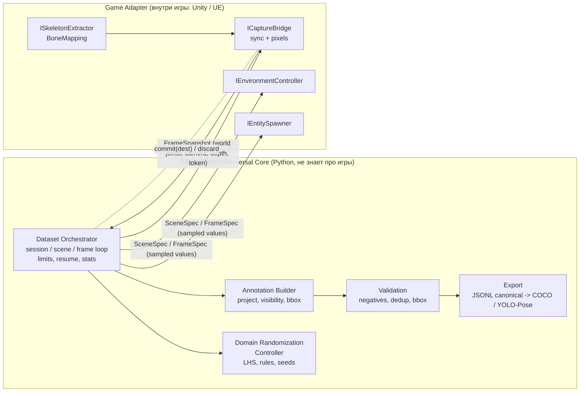

# DataOpen — архитектура системы сбора синтетических датасетов Human Pose

Универсальное ядро (Universal Core, Python) + игра-специфичные адаптеры (Game Adapters, C#/C++ внутри движка).
Статус: ядро и mock-адаптер реализованы и покрыты тестами (26 шт.); C#-контракты для Unity — эскиз без компиляции.

## 0. Что я изменил или уточнил относительно ТЗ

| # | В ТЗ | Что сделано | Почему |
|---|------|-------------|--------|
| 1 | «12 костей» | Схема из **13** точек, настраиваемая (`SkeletonSchema`) | В перечне: голова, шея, 2 плеча, 2 локтя, 2 запястья, таз, 2 колена, 2 лодыжки = 13. Нужно решение: оставить 13, убрать шею или заменить таз на 2 бедра. Это одна строка в `schema.py`, всё остальное (COCO, YOLO, flip_idx) подстраивается само |
| 2 | Проекция 3D→2D «в ядре или адаптере» не указано | Адаптер отдаёт **сырые мировые координаты + камеру**, проецирует **ядро** | Математика ground truth реализована и протестирована один раз, а не на каждую игру. Адаптер получается тонким: добавить игру = реализовать интерфейсы |
| 3 | Рандомизация в ядре | Адаптер **объявляет** пространство параметров (`parameter_space()`), ядро **сэмплирует**, адаптер **применяет** | Список скинов/оружия знает только игра, а стратегия сэмплирования, воспроизводимость и покрытие должны быть едиными |
| 4 | Плоский цикл по кадрам | Двухуровневый: **Session → Scene → Frame** | Смена уровня/времени суток/погоды/популяции дорогая, смена камеры и фазы анимации дешёвая. Много кадров на сцену — главный рычаг скорости |
| 5 | Сохранение кадра | Двухфазное: `capture` (без записи пикселей) → валидация → `commit` / `discard` | Отбракованные кадры (в прогоне на mock — около половины попыток; на реальной игре надо мерить) не кодируются и не пишутся на диск |
| 6 | Visibility 2/1/0 | Реализовано, плюс нюансы (раздел 4): joint лежит *внутри* тела | Наивный depth-тест с зазором в 0 даёт самоперекрытие у каждого сустава |
| 7 | train/val не упоминаются | Сплит **по сцене**, не по кадру | Кадры одной сцены почти дубликаты; сплит по кадрам даёт утечку и завышенные метрики |
| 8 | — | Детерминизм: любой кадр = функция `(session_seed, scene, frame)` | Воспроизведение дефектов, resume, отладка адаптера |

## 1. Слои



Правило границы: **адаптер не содержит** сэмплирования, проекции, видимости, форматов. **Ядро не импортирует** ничего движкового.

Структура репозитория:

```
src/dataopen/core/
  schema.py         SkeletonSchema, BoneMapping (имя кости -> унифицированная точка, с весами)
  models.py         все структуры данных (SceneSpec, FrameSpec, FrameSnapshot, Annotation, FrameRecord)
  interfaces.py     IGameAdapter, IEntitySpawner, IEnvironmentController, ISkeletonExtractor, ICaptureBridge
  randomization.py  IDomainRandomizer + DomainRandomizationController, ParameterSpace, LHS, правила
  projection.py     project(), visibility_flags()
  annotation.py     AnnotationBuilder: snapshot -> аннотации + вердикты по каждому персонажу
  validation.py     NegativeFrame / PositiveFrame / DuplicateFilter
  export.py         CanonicalStore (JSONL), COCO Keypoints, YOLO-Pose (+ data.yaml с flip_idx)
  orchestrator.py   DatasetOrchestrator, SessionConfig, SessionReport
src/dataopen/adapters/mock/   эталонная реализация адаптера без игры (numpy)
adapters/unity/Contracts/     C#-зеркало контрактов + эскиз Unity (не компилировалось)
```

## 2. Интерфейсы (кратко; полный код в `core/interfaces.py`)

| Интерфейс | Ответственность | Ключевые методы |
|---|---|---|
| `IGameAdapter` | Фасада, собирает остальное | `info`, `parameter_space()`, `spawner`, `environment`, `extractor`, `capture`, `connect/close/restart` |
| `IDomainRandomizer` (ядро) | Решает *значения* | `sample_scene(i) -> SceneSpec`, `sample_frame(scene, j, kind) -> FrameSpec` |
| `IEntitySpawner` | Спавн/рандомизация NPC (экипировка, скин, оружие, анимация) | `spawn(scene)`, `update_actors(handles, frame)`, `set_active(handles, bool)`, `despawn_all()` |
| `IEnvironmentController` | Время суток, погода, туман, экспозиция | `apply(scene)` |
| `ISkeletonExtractor` | Кости движка → унифицированная схема | `extract(handles) -> [EntityState]`, `mapping_for(rig_id)` |
| `ICaptureBridge` | Synchronization Bridge | `capture(req) -> FrameSnapshot`, `commit(snap, dest)`, `discard(snap)` |
| `IFrameValidator` (ядро) | Фильтры | `check(spec, snap, built) -> reason \| None` |

`Capability` (DEPTH, ENGINE_VISIBILITY, HULL_POINTS, DETERMINISTIC_STEP) позволяет адаптеру честно заявить, что он умеет; ядро выбирает источник окклюзии по приоритету.

**Соглашения, которые адаптер обязан соблюдать** (иначе всё поедет молча):
- единицы — метры; камера — OpenCV (x вправо, y вниз, z вперёд), экстринсики world→camera;
- пиксели непрерывные, начало в левом верхнем углу левого верхнего пикселя.

Конвертация из движков (проверить тестом на каждой игре, см. раздел 7):
- **Unity** (левосторонняя, Y вверх): `W2C_cv = diag(1,-1,-1,1) · camera.worldToCameraMatrix`; `fx = P[0,0]·W/2`, `fy = P[1,1]·H/2`. Lens shift в эскизе не учтён.
- **Unreal** (левосторонняя, Z вверх, **сантиметры**): строки матрицы = (right=+Y, down=−Z, forward=+X), перевод cm→m ×0.01.

## 3. Протокол сбора одного кадра

```mermaid
sequenceDiagram
  participant O as Orchestrator
  participant R as DomainRandomizer
  participant A as Adapter (spawner/env)
  participant B as CaptureBridge (engine)
  participant P as AnnotationBuilder + Validators
  participant S as Store / Export
  Note over O,A: Начало сцены (дорого, раз в N кадров)
  O->>R: sample_scene(i)  [pure f(seed,i)]
  O->>A: environment.apply(scene); spawner.spawn(scene)
  loop frames_per_scene
    O->>R: sample_frame(scene, j, kind)  [kind: positive|negative]
    O->>A: set_active(kind==positive); update_actors(frame)
    O->>B: capture(CaptureRequest{frame_id, spec})
    Note over B: 1 поставить камеру из CameraSpec (коллизии -> AdapterError)<br/>2 settle: N фикс. тиков (анимация, физика, LOD, TAA, стриминг)<br/>3 в конце кадра, симуляция на паузе: кости + камера + (depth)<br/>4 GPU readback async, ключ = frame_token
    B-->>O: FrameSnapshot (мировые суставы, камера, depth, thumbnail)
    O->>P: build(snapshot): project -> visibility -> bbox -> verdicts
    P->>P: validators (negative-clean, >=1 annotation, no unlabeled person, dedup)
    alt accepted
      O->>B: commit(snapshot, images/<split>/<frame_id>.png)
      O->>S: record -> буфер сцены
    else rejected
      O->>B: discard(snapshot)  [нет encode, нет I/O]
    end
  end
  O->>S: flush сцены: JSONL + YOLO txt; manifest.scenes_done = i+1 (resume)
  O->>A: despawn_all()
```

Критичные инварианты:
1. **Пиксели, кости и камера берутся в один момент движка** и привязаны токеном. Кости читать там же, где рендерится кадр (клиент), а не на сервере — репликация отстаёт.
2. Ядро получает *скелет в мире*, не пиксели. Картинка движок→диск напрямую, через Python не проходит.
3. Любая ошибка адаптера (`AdapterError`) не валит сессию: сцена пропускается, после N подряд — `adapter.restart()`.
4. Остановка: цель по кадрам, лимит времени, лимит попыток (`3 × target`), лимит пустых сцен подряд. Resume — по `manifest.json` (гранулярность — сцена; файлы кадров детерминированно именованы, перезапись идемпотентна).

## 4. Аннотации и видимость

Структура (`core/models.py`): `FrameRecord{frame_id, scene/frame index, split, file_name, w, h, kind, annotations[], meta{seed, tick, environment, camera}}`, `Annotation{entity_id, keypoints (K,3)=[x,y,v], bbox xywh, meta}`. JSONL — единый источник истины, COCO и YOLO — производные.

Флаги: `2` виден, `1` в кадре, но перекрыт, `0` вне кадра / за камерой / кость отсутствует (тогда x=y=0, по соглашению COCO). Совпадают с COCO и YOLO-Pose.

Источники окклюзии (приоритет):
1. `engine_visibility` — raycast из камеры в сустав по коллайдерам частей тела. Единственный способ корректно получить самоперекрытие (рука за торсом).
2. `depth` — z-глубина **окклюдеров**. Сустав лежит *внутри* тела, поверхность самого персонажа ближе к камере на 5–15 см. Поэтому depth-pass надо рендерить **без целевых персонажей** (тогда `depth_tol` мал, по умолчанию 5 см) либо поднимать допуск выше радиуса тела (тогда тонкие перегородки перестанут считаться окклюдерами).
3. Нет ни того, ни другого — всё в кадре помечается visible, ядро пишет предупреждение в `meta.warnings`.

Вердикты по персонажу и политика: `ACCEPT` → аннотация; `ABSENT` (нет ни одного visible сустава) → не аннотируется, это норма; `IGNORE_*` (мелкий, слишком перекрыт, кривой bbox) → по умолчанию **кадр отбраковывается** (`strict_unlabeled`): видимый, но не размеченный человек учит детектор считать людей фоном.

Bbox: если адаптер дал `hull_points_world` (границы меша) — точный bbox из проекции; иначе по суставам + 8% отступ (суставы не включают макушку/кисти — bbox будет заниженным). Для D-FINE (детектор без keypoints) используются `bbox` из того же COCO JSON.

Негативные примеры: `kind=negative` с долей `negative_ratio`, актёры скрыты (`set_active(false)`), `NegativeFrameValidator` проверяет, что ни один персонаж не просматривается; пишется пустой `.txt` (так Ultralytics трактует background-изображение) и картинка без аннотаций в COCO. Для качества моделей добавьте *hard negatives* (манекены, статуи, плакаты с людьми, пугала) — это работа адаптера через актёры с флагом `non_person`.

Дедупликация: (а) по квантованному состоянию камеры+скелетов (дёшево, без декода пикселей); (б) опционально по dHash миниатюры — **выключено по умолчанию**: при мелких персонажах миниатюра почти не меняется, а однотонные кадры (туман, небо) дают ложные срабатывания; включать с `hamming=0` для ловли «застрявшего readback» (состояние сдвинулось, пиксели нет).

## 5. Доменная рандомизация

- Параметр = обратная CDF `from_unit(u)` → один Latin Hypercube покрывает и непрерывные, и категориальные параметры (в тесте: 64 сцены дают почти идеально плоскую гистограмму по времени суток).
- Детерминизм: `derive_seed(blake2b)`, не `hash()` (он солится на процесс); сцена и кадр — чистые функции индексов. Блок LHS пересчитывается из `(seed, block)`, состояния нет → resume бесплатен.
- Правила согласованности (`weather_consistency_rule`): «fog ⇒ плотный туман», «clear ⇒ мало облаков и тумана». Добавляйте правила на несовместимые комбинации (ночь + экстремальная экспозиция).
- Камера сэмплируется относительно цели (`distance, yaw, pitch, roll, fov, height_offset`), а не в мировых координатах; финальную позу и обработку коллизий решает адаптер.
- Дальше (не реализовано): отслеживание покрытия по бинам параметров и адаптивный пересев недопредставленных областей; curriculum (расширение диапазонов).

## 6. Узкие места при >100 000 кадров и способы обхода

Измерено только на mock (1–4 актёра, 1 поток, 320×240): постобработка в ядре ≈ 0.4 мс/кадр на проекцию+видимость+bbox и ≈ 0.02 мс на валидацию (500 принятых кадров, 1101 попытка). Ядро не будет узким местом; **всё остальное ниже — оценки по архитектуре, не замеры, их надо снять на реальной игре.**

| # | Узкое место | Почему | Что делать |
|---|---|---|---|
| 1 | **Рендер на GPU и «прогрев» кадра** (доминирует) | Нужно N тиков на settle: анимация, физика, TAA-история, стриминг текстур/LOD. Эффективные FPS на порядок ниже «игровых» | Снять лимит FPS и vsync (`targetFrameRate=-1`, UE `t.MaxFPS 0`); рендерить в целевом разрешении (640–1280, не 4K); отключить motion blur/DoF/DLSS, если не нужны; нескольких инстансов на GPU и на несколько GPU; фиксированный timestep + паузa симуляции |
| 2 | Смена сцены (уровень, погода, спавн) | Instantiate/Destroy, компиляция шейдеров/PSO, загрузка ассетов | 50–500 кадров на сцену; пул актёров (деактивация, не Destroy); прогрев PSO-кэша на первом проходе; предзагрузка бандлов |
| 3 | GPU→CPU readback | Синхронный readback останавливает конвейер | `AsyncGPUReadback` (Unity) / `ReadSurfaceData` через render-thread fence (UE), кольцо из 2–4 слотов; поэтому нужен `frame_token`, а кости читаются сразу |
| 4 | Кодирование и диск | PNG 1080p — десятки мс CPU; миллионы мелких файлов | JPEG q95 (libjpeg-turbo/nvJPEG) вместо PNG там, где допустимо; encode в отдельных потоках движка; `commit` только принятых кадров; шардирование каталогов (по 1–10k) или WebDataset/tar-шарды; локальный NVMe + асинхронная выгрузка в S3. Порядок объёма: 100k × 1080p ≈ 50 ГБ (JPEG) … 300 ГБ (PNG) |
| 5 | IPC | Пиксели через сокет — убийство | Только пути/токены и мелкие векторы (13×3 float на персонажа); depth — shared memory/файл; батчи кадров на один RPC; msgpack/protobuf |
| 6 | Python-постобработка | GIL, при >200 FPS на инстанс | Уже векторизовано (numpy, батч суставов); при росте — `multiprocessing` для аннотации и валидации, либо вынос в C++/numba. Дедуп по хешу не O(n²): скользящее окно (реализовано) или BK-tree/multi-index hashing |
| 7 | Деградация долгих сессий | Утечки памяти/VRAM в Unity/UE, дрейф | Watchdog: перезапуск процесса игры каждые N сцен или по порогу памяти (`restart()` уже в контракте); health-check; resume по манифесту |
| 8 | Отбраковка | При 40–60% reject реальная скорость падает в 2×+ | Следить за `rejects` в `report.json`; сузить пространство камеры (мелкие/перекрытые), не отбраковывать после рендера, а **не генерировать** заведомо плохие позы: pre-check видимости цели по глубине/bbox до рендера |
| 9 | Размер COCO JSON | Монолит на 100k+ кадров | JSONL как источник истины (реализовано), COCO собирается на финализации по сплитам; при необходимости шардировать |
| 10 | **Разнообразие, а не скорость** | 100k кадров из 200 сцен — почти дубликаты | Метрика покрытия по бинам параметров; сплит по сцене (реализовано); множество камер на сцену не заменяет разнообразия сцен |

Ориентир для планирования (допущения, не замер): при 5 эффективных FPS на инстанс 100k кадров ≈ 5.5 ч; 4 инстанса на GPU ≈ 1.4 ч. Реальные цифры дадут пилот на целевой игре и разрешении.

## 7. Что нужно проверить в реальном адаптере (чек-лист приёмки)

1. Спроецировать известную точку (угол калибровочного куба) и сравнить с её пикселем на рендере — на каждом движке, при ненулевом roll и нестандартном FOV.
2. Кадры с pitch/roll/fov на границах диапазонов; подтвердить y-flip и 0.5-пиксельное смещение.
3. Тест синхронизации: быстрая анимация (бег/прыжок) — кости совпадают с пикселями на одном и том же кадре при async readback.
4. Для каждого `rig_id` — визуальная отрисовка скелета поверх кадра (как делает mock-проверка) для человека-ревьюера.
5. Смещение «кость ≠ анатомическая точка»: плечо/таз в движке — центр сустава внутри тела; людская разметка (COCO) ставит точку на поверхность/иначе. Если модель будет сравниваться с реальной разметкой, нужны калиброванные оффсеты (виртуальные маркеры), иначе появится систематическое смещение (domain gap по определению ключевых точек).

## 8. Риски, не технические (важно для продажи Meta)

Это не юридическая консультация — уточните у юриста до пилота:
- **Лицензии на ассеты и ПО игры.** Модели персонажей, текстуры, анимации в коммерческих играх защищены; лицензии игр и анти-читы (EAC, BattlEye) обычно запрещают модификацию клиента и извлечение/коммерческое использование контента. Датасет, проданный третьей стороне, должен иметь чистое происхождение. Практичный путь: адаптер для **Unity/UE-сцены с собственными или лицензированными ассетами** (или open-source), а игровые адаптеры — как R&D/демонстрация переносимости.
- Что именно «нужно Meta» (разрешение, число персонажей в кадре, виды поз, форматы, egocentric/exocentric, цвета, hands) — зафиксировать в письменном ТЗ до проектирования схемы (13 vs 12 точек и т.д.).
- Метрики качества для покупателя: ground-truth точность (подтверждаемая разделом 7), покрытие распределения, отчёт о доменном разрыве (обучение на синтетике → тест на реальных данных).

## 9. Запуск

```bash
pip install -e '.[dev]'
python -m pytest -q
python -m dataopen.cli --adapter mock --out out/run1 --frames 500 --frames-per-scene 25
# out/run1: images/{train,val}, labels/{train,val} (YOLO-Pose), annotations/{train,val}.jsonl,
#           annotations/coco_{train,val}.json, data.yaml, manifest.json, report.json
```

## 10. План работ

1. Решить схему (13/12/14 точек) и требования Meta (разрешение, сценарии).
2. Выбрать первую платформу (рекомендую Unity с собственной сценой: проще всего пройти чек-лист из раздела 7).
3. Транспорт ядро↔адаптер: ZeroMQ или gRPC, управляющий канал + файлы/shared memory для данных; в Python — `RemoteAdapter(IGameAdapter)`, в C# — сервер, реализующий контракты из `adapters/unity/Contracts`.
4. Пилот 5–10k кадров, замер `report.json` по стадиям, обучение YOLO-Pose и проверка на реальном валидационном наборе.
5. Масштабирование: мультиинстанс/мультиGPU, шардированная выгрузка, мониторинг покрытия.
