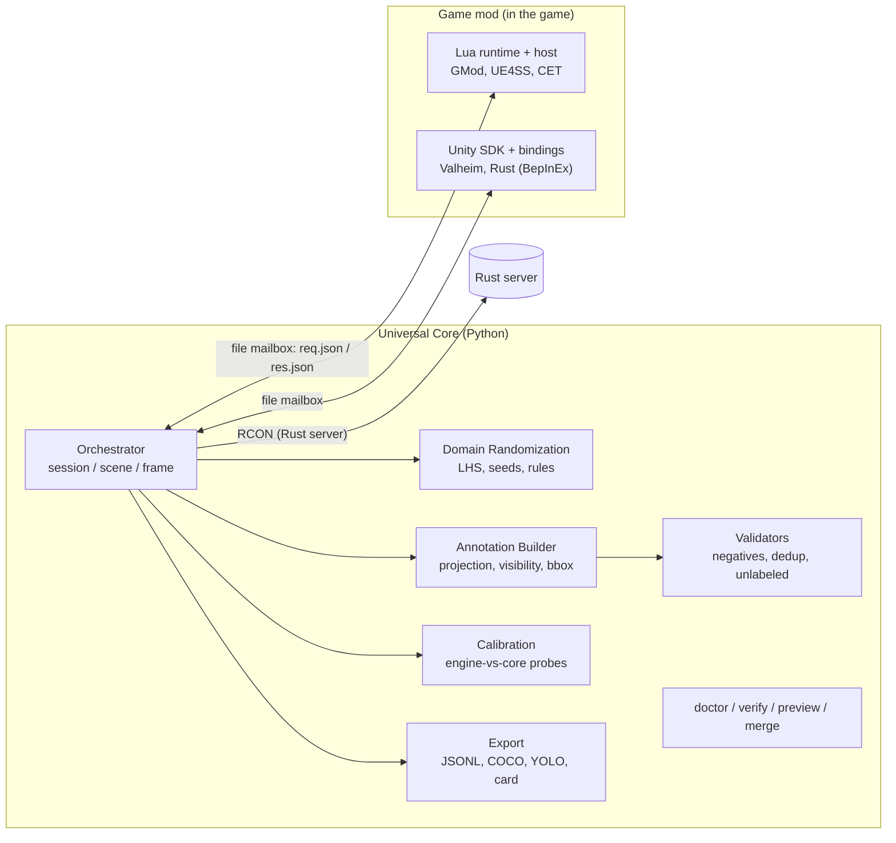

# DataOpen: архитектура

Система собирает синтетические датасеты Human Pose (COCO Keypoints, YOLO-Pose) из игровых движков.
**Universal Core** (Python) не знает про игры. **Game Adapter** (мод внутри игры) отвечает на простой JSON-протокол.

## Что решено и почему

| Решение | Почему |
|---|---|
| Проекцию 3D→2D, видимость, bbox, форматы делает **ядро**, мод отдаёт сырые мировые координаты и позу камеры | математика ground truth пишется и тестируется один раз; мод получается тонким |
| Камера на проводе = **поза** (`pos`, экранные `forward/right/up`, FOV) | не зависит от руки координат и осей движка (Unity LH Y-up, Source Z-up, UE cm...) |
| Транспорт = **файловый «почтовый ящик»** | единственное, что умеют все Lua-песочницы; C# тоже; ничего не нужно открывать в сети |
| **Пробы**: мод шлёт мировые точки и *родную* проекцию движка, ядро сверяет | ловит неверный FOV, перевёрнутую ось, сантиметры без единого эталонного кадра; несовпадение ⇒ кадр отбракован, повтор ⇒ `CalibrationError` |
| Адаптер **объявляет** пространство параметров, ядро **выбирает** значения | список скинов знает игра, а выборка, воспроизводимость и покрытие должны быть едиными |
| Сессия → **сцена** → кадр | смена среды дорогая, смена камеры дешёвая: много кадров на сцену — главный рычаг скорости |
| Два этапа записи кадра: `capture` → валидация → `commit` / `discard` | отбракованные кадры не кодируются и не пишутся |
| train/val делятся **по сцене** | кадры одной сцены почти дубликаты, иначе утечка и завышенные метрики |
| Любой кадр = функция `(seed, scene, frame)`; манифест по сценам | воспроизводимость, resume, отладка |
| Режим **observe** (брать существующих персонажей) наравне со `spawn` | запасной путь, если спавн в игре не заработал; для Unity-игр основной |
| Всё игровое задаётся **данными** (профили TOML, `[bones]`) | чинится без перекомпиляции мода |
| `doctor` перед сбором, `collect` отказывается при FAIL | самая частая ошибка — тихо испорченная разметка |

## Данные и разметка

- Ключевые точки: схема `human13` (голова, шея, 2 плеча, 2 локтя, 2 запястья, таз, 2 колена, 2 лодыжки = **13**; в исходном
  ТЗ было «12», решение за вами: схема — данные, меняется одной строкой в `core/schema.py`).
- Флаги: `2` виден, `1` в кадре но перекрыт, `0` вне кадра / за камерой / кость не найдена (`x=y=0`). Совпадают с COCO/YOLO.
- Источники видимости по приоритету: raycast движка (`engine_visibility`) → depth-карта окклюдеров → «виден».
  Самоперекрытие (рука за торсом) движок не видит: добавляется геометрическая оценка (капсула торса + сфера головы,
  `core/self_occlusion.py`, это эвристика с явными радиусами).
- bbox: точный из `hull_points` (границы меша), иначе по суставам + 8% отступ (занижает макушку и кисти).
- Видимый, но не размеченный человек учит детектор считать людей фоном, поэтому такие кадры отбраковываются
  (`unlabeled_person_present`). Негативные кадры: пустая метка YOLO, изображение без аннотаций в COCO.
- Точки координат сериализуются с 2 знаками; точка в пределах 0.01 px от края считается вне кадра (иначе округление
  даёт метку ровно на границе).
- Для D-FINE (детектор без ключевых точек) используется `bbox` из того же COCO.

Выход: `images/{split}/`, `labels/{split}/` (YOLO-Pose), `annotations/{split}.jsonl` (канонический источник),
`annotations/coco_{split}.json`, `data.yaml` (`kpt_shape`, `flip_idx`), `manifest.json`, `report.json`, `qa_report.*`,
`DATASET_CARD.json` (игра, версии, схема, сиды, хэш конфига, счётчики, **происхождение ассетов**).

## Рандомизация

Параметр = обратная CDF `from_unit(u)`: один Latin Hypercube покрывает и непрерывные, и категориальные параметры.
Сиды: `blake2b`, не `hash()`. Правила согласованности (туман ⇒ плотный туман; ясно ⇒ мало облаков). Камера
сэмплируется относительно цели (`distance, yaw, pitch, roll, fov, height_offset`). Не реализовано: адаптивный пересев
недопредставленных областей и curriculum.

## Игры

| Игра | Мод | Режим | Проверено |
|---|---|---|---|
| mock | `adapters/mock` (Python) | spawn | автоматически, сквозной протокол |
| Garry's Mod | Lua: клиентские модели + свободная камера (`render.RenderView`) | spawn | Lua-рантайм и хост — на заглушке API (LuaJIT); реальная игра — нет |
| Valheim | C#: BepInEx, Unity SDK, рефлексия для `EnvMan` | observe (+ spawn врагов) | синтаксис C# 7.3 и ключи протокола; **не собирался, не запускался** |
| Rust (свой сервер) | C# клиент + RCON сервера (`adapters/rcon.py`) | observe | RCON — против поддельного сервера; клиент не собирался |

Новая игра: `docs/MODDING.md`. Запуск и диагностика: `docs/RUNBOOK.md`. Протокол: `docs/PROTOCOL.md`.

## Узкие места при >100 000 кадров

Замеры только на mock (1 поток): аннотация ≈ 0.4 мс/кадр, валидация ≈ 0.02 мс. Ядро не будет узким местом.
Остальное — оценки по архитектуре, не замеры; их снимет `doctor` (строка `throughput`) на реальной игре.

| Узкое место | Что делать |
|---|---|
| Рендер и «прогрев» кадра (доминирует) | снять лимит FPS/vsync, рендерить в целевом разрешении, несколько экземпляров игры (`--shard i/n` + `merge`), несколько GPU |
| Смена сцены (уровень, погода, спавн) | 50–500 кадров на сцену, пул актёров, прогрев шейдеров |
| Чтение GPU→CPU | асинхронный readback, токен кадра; поэтому кости читаются сразу |
| Кодирование и диск | JPEG вместо PNG, кодирование только принятых кадров (`commit`), шардирование каталогов, NVMe |
| IPC | через файлы идут только пути и мелкие векторы (13×3 float на персонажа); картинки пишет сторона игры или ядро напрямую |
| Python-постобработка | уже векторизована; при росте — multiprocessing |
| Деградация долгих сессий | watchdog `health()`, `restart()`, resume по манифесту |
| Доля отбраковки | `report.json.rejects`; сузить диапазоны камеры, не генерировать заведомо плохие позы |
| Разнообразие, а не скорость | сплит по сцене, покрытие по бинам (`qa_report`), много сцен, а не много камер на одну |

Порядок объёма: 100k кадров 1080p ≈ 50 ГБ (JPEG) … 300 ГБ (PNG).

## Риски вне кода

Это не юридическая консультация. Модели, текстуры и анимации коммерческих игр защищены; лицензии игр обычно ограничивают
извлечение и коммерческое использование контента. Датасет, продаваемый третьей стороне, должен иметь понятное
происхождение: `DATASET_CARD.json.provenance` по умолчанию содержит `UNSPECIFIED` и напоминает его заполнить. Практичный
путь для продажи — собственные или лицензированные ассеты; игровые адаптеры — для демонстрации переносимости и R&D.
Кроме того, центр сустава в движке не совпадает с точкой, которую ставит человек-разметчик: при сравнении с реальной
разметкой нужны калиброванные оффсеты.
