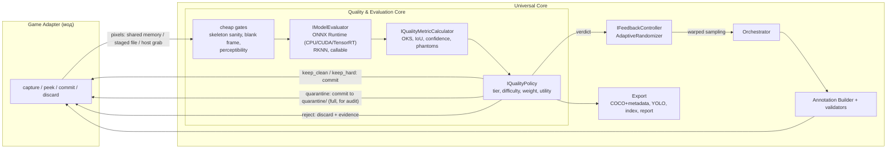

# Closed-Loop Validation (Inference-in-the-Loop)

Подсистема между захватом кадра и записью на диск: каждый кадр проверяется «на лету» в памяти, вердикт меняет и судьбу
кадра, и то, какие кадры генератор будет делать дальше.

## 0. Нужно ли это нам? Честная оценка

Нужно, и ваши три довода верны. Но есть ловушка, которую я заложил в архитектуру, а не обошёл молчанием.

**Что верно.** Движок отдаёт идеальные 2D-координаты и для чёрного кадра, и для человека, слившегося со стеной. Без проверки
по пикселям такие кадры учат модель ложным паттернам («вижу темноту — строю скелет»). Слепая рандомизация к тому же тратит
большую часть попыток впустую.

**Ловушка: «модель слепа» ≠ «кадр непригоден».** Если выбрасывать всё, что базовая модель не распознала, датасет сместится в
сторону того, что она уже умеет: самые ценные кадры (человек хорошо виден, а модель ошибается) будут удалены первыми.
Поэтому решение о выбросе принимается **только по свидетельствам, не зависящим от модели**:

| Свидетельство | Кто его даёт | Решение |
|---|---|---|
| 3D-скелет сломан (кости в разы длиннее нормы, асимметрия, NaN) | геометрия (`core/anthropometry.py`) | выбросить |
| Кадр пустой / пересвечен | статистика пикселей | выбросить |
| Размеченный человек **неразличим** в пикселях (контраст конечностей с фоном, яркость, размер) | признаки изображения (`quality/features.py`) | выбросить |
| Модель уверенно видит человека, которого нет в разметке | модель | выбросить (режим observe) или пометить сложным негативом (режим spawn) |
| Модель уверенно ставит скелет **в другом месте** внутри рамки разметки | модель | карантин на проверку человеком |
| Человек различим, но модель слепа или ошибается | модель + признаки | **оставить, пометить `keep_hard`, вес > 1**, генерировать больше похожих |

Эффект на mock (3 сида, 300 принятых кадров): адаптивная рандомизация тратит **~25% меньше попыток** на тот же объём;
доля сложных кадров в среднем выше (0.26 → 0.32), но от запуска к запуску шумит. На настоящей игре цифры будут другими.

**Контроль ложных отбраковок:** 2% отброшенных кадров сохраняются в `quality/audit/`, до 25 примеров на тип в
`quality/rejects/`. Если среди аудита много годных кадров, пороги слишком строгие.

**Дешёвый режим без модели** (`--quality-static`) уже даёт большую часть пользы: отсекает сломанные скелеты, пустые кадры и
неразличимых людей, GPU не нужен.

> Целевая схема keypoints (12 прицельных точек, два класса), метрики главной точки и как менять набор точек: [SCHEMAS.md](SCHEMAS.md).

## 1. Где это в архитектуре



## 2. Абстракции (`dataopen/quality/interfaces.py`)

| Интерфейс | Ответственность | Реализации |
|---|---|---|
| `IModelEvaluator` | Прогнать кадры через базовую модель, вернуть `Prediction` в пикселях исходного кадра. Потокобезопасен | `OnnxEvaluator` (YOLOv8-pose, D-FINE; провайдеры cpu/cuda/tensorrt/directml), `RknnEvaluator` (тонкая обёртка, **не проверена**), `CallableEvaluator` (любая функция), `SimulatedEvaluator` (тестовый двойник) |
| `IQualityMetricCalculator` | GT ↔ предсказания → `QualityMetrics` (OKS, IoU, уверенность, фантомы, несогласие) | `DefaultMetricCalculator` |
| `IQualityPolicy` | Метрики + признаки → `QualityVerdict` | `DefaultQualityPolicy` (`PolicyConfig`) |
| `IFeedbackController` | Принять вердикт, адаптировать выбор параметров; сохранить/восстановить состояние; отчёт | `AdaptiveRandomizer` |
| `IPixelSource` / `PixelHandle` | Кадр в памяти ядра с явным временем жизни (освободить слот) | shared-memory ring, staged file, host grab (`ICaptureBridge.peek_pixels`) |

Паттерны: конвейер из заменяемых стратегий (каждый шаг — интерфейс), «дешёвые ворота перед дорогим шагом», ограниченная
очередь в полёте (обратное давление), чистые функции индексов для воспроизводимости, состояние контроллера как
сериализуемый снимок.

## 3. Обновлённый Pipeline Workflow (один кадр)

```mermaid
sequenceDiagram
  participant O as Orchestrator
  participant R as AdaptiveRandomizer
  participant M as Game mod
  participant Q as QualityPipeline (worker pool)
  participant F as Feedback
  O->>R: sample_frame(scene, j)   [значения через изученный warp]
  O->>M: capture_frame -> snapshot (кости, камера, пробы)
  O->>O: пробы, разметка, валидаторы   (дёшево, синхронно)
  alt отказ валидатора
    O->>M: discard
    O->>F: observe(REJECTED, utility 0)
  else прошёл
    O->>M: peek(frame_token) -> пиксели в shared memory (zero copy)
    O->>Q: submit(кадр)   -- движок уже рисует следующий
    Q->>Q: признаки изображения + 3D-санити
    Q->>Q: дешёвые ворота: выбросить без инференса?
    Q->>Q: модель -> предсказания -> OKS/IoU/фантомы -> вердикт
    Q-->>O: вердикт (по порядку захвата)
    alt keep_clean / keep_hard
      O->>M: commit в датасет (кодирование и запись на стороне игры)
    else quarantine
      O->>M: commit в quarantine/ (полный мини-датасет для аудита, в обучение не идёт)
    else reject
      O->>M: discard; quality/rejects, rejects.jsonl, аудит
    end
    O->>F: observe(вердикт)
    F->>R: tilt обновляется каждые N кадров
  end
```

`max_inflight` кадров валидируются, пока движок рисует следующие; слоты общей памяти дают обратное давление, медленный
инференс притормозит захват, а не съест память.

## 4. Структуры данных

### Вердикт (`quality/types.py: QualityVerdict`)

| Поле | Смысл |
|---|---|
| `verdict` | публичный вердикт из 4 классов (таблица ниже) |
| `tier` | детальный код причины: `keep`, `keep_hard`, `hard_negative`, `drop_invisible`, `drop_gt_sanity`, `drop_render`, `drop_phantom`, `suspect`, `rejected` |
| `policy_version` | какая версия правил вынесла вердикт (правила можно менять во время сбора, см. 5.2) |
| `reasons[]` | почему: `model_blind_but_visible(oks=0.04)`, `imperceptible_person(entities=[3])`, ... |
| `difficulty` | 0..1: статическая (различимость 45%, окклюзия 35%, размер 20%), с моделью: 50/50 с `1 − mean OKS` |
| `occlusion_index` | доля ключевых точек, не видимых (0..1) |
| `contrast_rate` | цветовое расстояние между видимыми конечностями и окружением (0..1) |
| `weight` | рекомендуемый вес в обучении: 1.0 обычный, `1 + difficulty` сложный, 0 для выброшенных |
| `utility` | награда для рандомизатора: 1.0 «модель слепа, но видно», 0.8–1.0 сложный, 0.1–0.5 обычный, 0 мусор |
| `metrics` | `QualityMetrics` (ниже) |
| `features` | `FrameFeatures` (ниже) |

### Четыре вердикта

| `verdict` | Что это | Куда попадает | `tier` |
|---|---|---|---|
| `keep_clean` | идеальный кадр: годный, модель справляется | датасет | `keep` |
| `keep_hard` | человек виден, а модель ошибается: **самые ценные** кадры | датасет, вес `1 + difficulty` | `keep_hard`, `hard_negative` |
| `quarantine` | метки и модель уверенно противоречат друг другу (человек, которого нет в разметке; уверенная модель с другими точками): либо баг разметки, либо ложное срабатывание | `quarantine/`: **полный** мини-датасет (`images/`, `labels/`, `annotations/`, COCO), в обучение не идёт, счётчик `target_frames` не увеличивает | `suspect`, `drop_phantom` |
| `reject` | мусор: сломанный скелет, пустой/пересвеченный кадр, неразличимый человек | нигде, остаётся запись в `quality/rejects.jsonl`, выборка примеров и аудит | `drop_gt_sanity`, `drop_render`, `drop_invisible`, `rejected` |

Просмотр карантина: `dataopen preview <out>/quarantine`. Новый тип причины обязан получить вердикт (тест это проверяет).

### Метрики (`QualityMetrics`)
`evaluated, backend, latency_ms, n_gt, n_pred, n_phantom, mean_oks, min_oks, oks_spread, recall, mean_iou, mean_conf,
max_disagreement_score, persons[{entity_id, oks, iou, score, keypoint_conf_mean}]`.
OKS по COCO; сигмы по ключевым точкам в `SkeletonSchema.sigmas`. Для моделей без ключевых точек (D-FINE) `oks`
деградирует до IoU. Совпадение жадное по OKS, каждое предсказание объясняет одного человека.

### Признаки (`FrameFeatures`)
`has_pixels, luma_mean, luma_std, saturated_frac, gt_issues[], persons[{contrast_rate, brightness, occlusion_index,
size_px, sharpness, perceptibility, limiting_factor, difficulty}]`. `limiting_factor` (`contrast`/`brightness`/`size`)
попадает в причину отбраковки: `imperceptible_person(entity 3: limited_by=contrast (contrast=0.012, luma=0.08, h=34px))`.
Различимость 0..1 = контраст × яркость × размер. Пиксели берутся по **видимым**
суставам и костям между ними, поэтому камуфляж и сливающаяся с фоном одежда ловятся.

### Метаданные в датасете
- `annotations/*.jsonl`: `meta.quality = verdict.to_dict()`, `meta.units` (единичные выборки: можно воспроизвести кадр),
  `meta.actors`, `meta.actor_frame`; в каждой аннотации `meta.{oks_score, difficulty_score, occlusion_index, contrast_rate,
  perceptibility}`.
- COCO: у `images` поля `verdict, tier, difficulty_score, weight, occlusion_index, contrast_rate, oks_score`; у `annotations`
  `oks_score, difficulty_score, occlusion_index, contrast_rate, perceptibility` (обычные загрузчики игнорируют лишние
  поля; старые имена `difficulty`, `mean_oks`, `oks` пока дублируются).
- **YOLO-Pose `.txt` остаётся строго стандартным** (5 + 3·K колонок): лишние колонки ломают Ultralytics. Метаданные лежат
  рядом и соединяются по `frame_id`: `quality_index.csv` (кадр: verdict, tier, difficulty_score, contrast_rate,
  occlusion_index, oks_score, weight, policy_version, причины; колонка `set` = dataset | quarantine) и
  `quality_persons.csv` (человек в кадре).
- `quality_index.json`: то же в JSON для curriculum и взвешенного обучения.
- `closed_loop_report.{json,md}`: что видел валидатор и чему научился рандомизатор, таблица «где модель страдает».
- `quality/rejects.jsonl`, `quality/rejects/<tier>/`, `quality/audit/<tier>/`: свидетельства по выброшенным кадрам.
- `feedback_state.json`: состояние адаптации (для resume).

## 5. Адаптивная доменная рандомизация (`quality/feedback.py`)

Механизм. Каждый параметр выбирается через обратную CDF `from_unit(u)`. Между стратифицированной выборкой `u` и значением
стоит кусочно-постоянный **warp** по бинам единичного интервала. Каждый вердикт даёт награду всем параметрам кадра;
бины, которые дают крайние случаи, растут в плотности, бины с мусором и тривиальными кадрами сжимаются.

- Маргинальная, дешёвая адаптация: один вектор наклонов на параметр, без модели совместного распределения.
- Ограничена: наклон в `[floor, cap]` плюс UCB-бонус редким бинам ⇒ охват не схлопывается.
- Категориальные параметры (скины, одежда, оружие) — тоже бины: цикл сам выучивает, **какие внешности ломают модель**, без
  перебора комбинаций. Отчёт показывает покрытие парных комбинаций внешности.
- Добыча крайних случаев: с вероятностью `exploit_p` новая выборка — зашумлённая копия запомненного сложного примера.
- Отказы до стадии качества (человек слишком мелкий и т.п.) тоже учитываются как потраченная впустую попытка.
- Прогрев `warmup_frames` равномерно, дальше обновление каждые `update_every` кадров. Состояние сохраняется; значения
  зависят от истории, поэтому в запись пишутся единичные выборки.

### 5.1. Баланс датасета и защита от OOD (`quality/balance.py`)

Наклоны по бинам отвечают на вопрос «какие значения дают ценные кадры». Но они не знают, **каким становится датасет
целиком**. `BalanceController` смотрит на скользящее окно вердиктов (200) и крутит три глобальные ручки в заданных пределах:

| Симптом в окне | Реакция |
|---|---|
| Доля `keep_hard` среди годных ниже цели (`target_hard_share`, 0.30): датасет тонет в простых кадрах | `gamma_scale`↑ (резче наклоны) и чаще повтор запомненных крайних случаев |
| Доля `keep_hard` выше цели: генератор уехал в угол экстремальных условий | `gamma_scale`↓; если выше цели + `hard_margin` ещё и `uniform_mix`↑ (до 0.5) |
| Доля `reject` выше `max_reject_share` (0.15): тёмные/нереалистичные области | бины с высокой долей брака подавляются сильнее (`(1 − drop_rate)^drop_penalty`) |

`uniform_mix` (не меньше 0.10) это доля выборок, которые обходят все наклоны и берут нетронутую стратифицированную выборку
по всему приору: гарантия охвата и несмещённые оценки по бинам. Цена: адаптация чуть слабее (остаточный «мусорный» регион
не сжимается до нуля).

**Дрейф** (`closed_loop_report`, ключ `drift`): для каждого параметра KL(реальное распределение ‖ приор), нормированная
энтропия и охват наименее покрытого бина; `drift_warnings`, если KL > 0.35 или бин получил < 8% своей массы. Это число
показывает ревьюеру, что рандомизация не схлопнулась.

Измерено на mock (3 зерна, 300 кадров, `--quality-sim`; шумно, это не гарантия для реальной игры):

| режим | попыток на 300 кадров | доля `keep_hard` |
|---|---|---|
| равномерная рандомизация | ~852 | 0.28 |
| адаптивная, без регулятора | ~683 | 0.35 |
| адаптивная + регулятор (цель 0.30) | ~667 | 0.32 |

На синтетическом потоке «сложно, если густой туман» регулятор держит долю сложных около запрошенной цели (0.30 → 0.30–0.36;
0.10 → 0.14–0.16), а без него майнинг уезжает до ~0.45 (тест `test_quality_balance.py`).

### 5.2. Правила «на лету» и пересчёт готового датасета

- `IQualityPolicy.reconfigure(spec)` меняет пороги между кадрами и увеличивает `version`, который пишется в каждый вердикт.
  `QualityPipeline` перечитывает TOML-файл (`--quality-policy`, по умолчанию `<out>/quality_policy.toml`), когда меняется его
  mtime. Опечатка в ключе или битый TOML: правила **не** меняются, ошибка попадает в `policy_changes` отчёта и в лог.
  Формат: плоский файл или таблица `[policy]` с полями `PolicyConfig` (`blind_oks`, `hard_oks`, `invisible_perceptibility`,
  `min_contrast_rate`, `min_brightness`, `phantom_action`, ...).
- `dataopen requalify <out> --policy new.toml` применяет новые пороги к сохранённым признакам и метрикам (политика это чистая
  функция, пиксели не нужны): `quality_requalified.csv` (старый → новый вердикт) и `excluded_frames.txt`. **Ужесточить можно,
  вернуть уже выброшенные кадры нельзя**: у них нет пикселей; для спорных случаев и существует карантин.

## 6. Производительность

- Дешёвые ворота стоят до инференса: кадр, выброшенный по пикселям/скелету, GPU не трогает (в отчёте
  `dropped_by_cheap_gates`).
- `sample_every = N`: модель только на каждом N-м кадре, ворота всегда.
- Пул потоков + `max_inflight`: инференс перекрывается с рендером следующих кадров (ONNX Runtime отпускает GIL).
- Zero-copy: мод пишет сырой RGB прямо в сегмент общей памяти, который создало ядро; ядро читает numpy-представление без
  копии. Для Lua-модов (нет общей памяти) — через staged-файл PNG. Кодирование и запись принятых кадров остаётся на стороне
  игры (`commit`), отброшенные не кодируются.
- Что **не сделано**: батчинг кадров в один вызов модели (сейчас по одному), даунскейл на стороне игры по `max_side`,
  мультипроцессная оценка.

## 7. Запуск

```bash
pip install -e '.[dev,capture,quality]'
# проверить модель и отображение точек на одной картинке (рисует overlay)
dataopen eval-image --model yolov8n-pose.onnx --image sample.png --keypoint-map coco17

# сбор: дешёвые ворота без модели
dataopen collect --game gmod --out runs/a --frames 1000 --quality-static
# с моделью и адаптацией, TensorRT через ONNX Runtime
dataopen collect --game gmod --out runs/a --frames 1000 --quality-model yolov8n-pose.onnx --quality-device tensorrt --adaptive
# без модели, демонстрация цикла (тестовый двойник, видит разметку: только для отладки)
dataopen collect --game mock --out runs/demo --frames 300 --quality-sim --adaptive
```

Настройки: секции `[quality]` (`min_person_px = 20`: видимый человек ниже 20 px бракует кадр, ниже 12 px игнорируется),
`[quality.policy]`, `[quality.balance]`, `[quality.feedback]` в профиле игры. Для spawn-режима (GMod, mock)
`phantom_action = "hard"`, для observe-режима (Unity) `"quarantine"` (`"drop"` принимается как синоним): там мод может не знать
о реальном человеке, и тогда детекция модели это единственная защита от неразмеченного человека в кадре, а кадр уходит на
аудит, а не молча в мусор.

### Пороги по умолчанию

| Порог | Значение | Что делает |
|---|---|---|
| `min_person_px` (`AnnotationConfig.min_bbox_height_px`) | 20 | человек ниже: кадр бракуется до записи на диск; ниже 12 px не размечается, кадр остаётся |
| `invisible_perceptibility` | 0.12 | различимость (контраст × яркость × размер) ниже: `reject` |
| `min_contrast_rate`, `min_brightness` | 0 (выкл.) | явные пороги контраста с фоном и яркости конечностей |
| `blank_luma_std`, `saturated_frac` | 0.01, 0.97 | пустой / пересвеченный кадр: `reject` |
| `blind_oks`, `hard_oks` | 0.15, 0.60 | модель слепа / страдает при видимом человеке: `keep_hard` |
| `suspect_conf` | 0.70 | уверенное несогласие модели: `quarantine` |
| `target_hard_share`, `max_reject_share` | 0.30, 0.15 | цели регулятора баланса |

Значения подобраны на mock; на реальной модели их надо калибровать (`eval-image` + `quality_index.csv`).

## 8. Ограничения, о которых надо знать

- **Модель и отображение точек.** COCO-модель даёт 17 точек, у нас 13: шея и таз вычисляются (середина плеч, середина
  бёдер), голова ≈ уши. Положение центра сустава в движке не совпадает с точкой разметчика, поэтому OKS на синтетике ниже,
  чем на реальных данных; пороги `blind_oks`/`hard_oks` калибруйте на ваших кадрах (`eval-image` + `quality_index.json`).
- D-FINE: ожидается экспорт с входами `images` и `orig_target_sizes` и выходами `labels, boxes, scores`; простой resize до
  входа, без letterbox. Без ключевых точек: только IoU и уверенность.
- **Не проверено на реальных моделях и железе:** TensorRT/CUDA-провайдеры (в окружении нет GPU), RKNN, общая память на
  стороне C# (Windows `MemoryMappedFile`; запасной путь — файл). Декодеры проверены на синтетических ONNX-моделях с известным
  выходом (геометрия letterbox, NMS, раскладка тензора, отображение точек).
- Смещение отбора контролируется политикой (раздел 0) и аудитом, но не исчезает: порог различимости остаётся эвристикой.

## 9. Вопрос про скины и одежду (Rust и любая игра)

> Сможет ли модель задетектить игрока, если одежда другая? Комбинаций экипировки слишком много.

**Короткий ответ:** да, как правило, и перебирать комбинации не нужно.

- Детекторы людей и позы учатся на форме тела и структуре, а не на конкретной одежде. Ломают их в основном: камуфляж и
  «гилли» (сливаются с фоном), низкий контраст (туман, ночь, цвет как у стены), необычный силуэт (капюшон + рюкзак),
  сильная окклюзия, малый масштаб. Это как раз то, что ловит цикл (различимость и OKS), а не конкретный предмет.
- Признаки внешности (голова, торс, ноги, обувь, рюкзак, оружие, тон кожи) почти независимы. Достаточно **выбирать каждый слот
  независимо** (так и делает ядро) и следить за охватом **значений** и пар значений (`pairwise_appearance_coverage` в
  отчёте). Полный перебор не нужен: 6 слотов по 10 вариантов = миллион комбинаций, а охват всех пар — сотни кадров.
- Цикл сам находит, **какие значения** (какой скин, какая броня) роняют OKS, и сэмплирует их чаще (таблица «где модель
  страдает» в отчёте). Для покупателя вам нужен не «каждый скин Rust», а разнообразие текстур, цветов и силуэтов: для
  реальных людей полезнее случайная перекраска и текстуры, чем перечень игровых предметов.
- **Честное ограничение текущей реализации:** клиентский плагин Rust работает в режиме observe: он снимает тех людей,
  которые есть в сцене, и не меняет им одежду. Рандомизация внешности сейчас есть для Garry's Mod (модели игроков, бодигруппы,
  скины, оружие) и для mock; в Rust её можно добавить командами сервера в `[server] scene_begin`, но имена команд нужно
  подтвердить на вашей версии.
